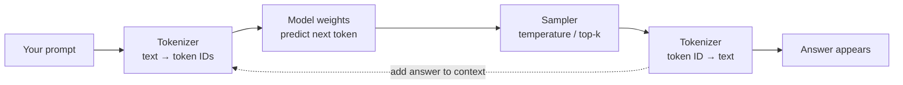

# Run and Prompt a Hugging Face Model Manually

This guide explains what happens between downloading a model from [Hugging Face](https://huggingface.co/) and getting an answer from it. It uses this repository's `niuk77/nanochat-d12` model as the example.

You do not need to understand neural-network math to follow the guide. The short version is:

1. Download the model files and this repository's code.
2. Install the Python dependencies.
3. Put the files where NanoChat expects them.
4. Run `scripts.chat_cli` with either the base or chat model.
5. Type a prompt, or pass one with `-p`.

## The big picture

A language model does not read a sentence and look up an answer in a database. It repeatedly predicts the next small piece of text, called a **token**. The tokenizer converts text to token IDs; the model predicts the next token ID; the tokenizer converts that ID back to text.



The loop runs once for every generated token. That is why the model can produce a paragraph without storing a paragraph as a single object.

## Two models in this repository

The Hugging Face repository contains two useful checkpoints:

| Checkpoint | What it learned | Best way to prompt it |
| --- | --- | --- |
| `base` | General next-token prediction from pretraining | Give it the beginning of text and ask it to continue |
| `sft` | Additional supervised fine-tuning for conversations | Ask a direct question or give an instruction |

The `sft` model is the right first choice for chat. The `base` model may continue, repeat, or wander because it was not trained to behave like an assistant.

> Important: this particular Hugging Face repository contains NanoChat checkpoint files, not a ready-made `transformers` model with a standard `AutoModelForCausalLM` interface. Use the NanoChat code in this repository to load these files. A different Hugging Face model may use different code and a different prompt format.

## What you need

- A clone of this repository.
- Python 3.10 or newer.
- Enough disk space for the model files (the two checkpoints together are several GB).
- For a comfortable experience, a CUDA GPU with enough VRAM. CPU and Apple Silicon can work for experimentation, but generation will be slower.

You can run the commands below on your own computer or inside a cloud GPU machine such as RunPod. A cloud machine is often easier for a model of this size.

## 1. Install NanoChat

From the repository directory, install `uv` if you do not already have it, then create the environment:

```bash
# NVIDIA GPU
uv sync --extra gpu

# CPU or Apple Silicon instead
# uv sync --extra cpu

source .venv/bin/activate
```

Check that the project is available:

```bash
python -m scripts.chat_cli --help
```

## 2. Get the model files

The model is published at [`niuk77/nanochat-d12`](https://huggingface.co/niuk77/nanochat-d12). There are two practical ways to use it.

### Option A: use checkpoint files you already downloaded

NanoChat looks in `~/.cache/nanochat` by default. The expected layout is:

```text
~/.cache/nanochat/
├── base_checkpoints/
│   └── d12/
│       ├── model_001680.pt
│       └── meta_001680.json
└── chatsft_checkpoints/
    └── d12/
        ├── model_000007.pt
        └── meta_000007.json
```

The optimizer files are useful for resuming training, but are not needed just to prompt the model. If your files are somewhere else, either copy the two checkpoint directories into the layout above or point NanoChat at their parent directory:

```bash
export NANOCHAT_BASE_DIR=/path/to/the/parent/directory
```

For example, if your files are in `/data/nanochat/base_checkpoints` and `/data/nanochat/chatsft_checkpoints`, set `NANOCHAT_BASE_DIR=/data/nanochat`.

### Option B: download the public Hugging Face repository

The Hugging Face CLI can download the entire public repository. Install it into the active environment if necessary:

```bash
uv pip install huggingface_hub
```

Download the files to a temporary directory first:

```bash
MODEL_DOWNLOAD_DIR=/tmp/nanochat-d12
hf download niuk77/nanochat-d12 \
  --repo-type model \
  --local-dir "$MODEL_DOWNLOAD_DIR"
```

The public repository's files are grouped under `base/` and `sft/`, while NanoChat expects slightly different directory names. Move the checkpoint folders into that expected layout:

```bash
mkdir -p ~/.cache/nanochat/base_checkpoints ~/.cache/nanochat/chatsft_checkpoints
mv "$MODEL_DOWNLOAD_DIR/base" ~/.cache/nanochat/base_checkpoints/d12
mv "$MODEL_DOWNLOAD_DIR/sft" ~/.cache/nanochat/chatsft_checkpoints/d12
```

Confirm that `~/.cache/nanochat/base_checkpoints/d12` and `~/.cache/nanochat/chatsft_checkpoints/d12` each contain a `model_*.pt` file and a matching `meta_*.json` file. The optimizer files are optional for inference.

## 3. Run one prompt

Run the SFT/chat model first:

```bash
python -m scripts.chat_cli -i sft -p "Why is the sky blue?"
```

The command loads the latest SFT checkpoint, generates one answer, prints it, and exits. Try a few prompts:

```bash
python -m scripts.chat_cli -i sft -p "Explain recursion to a beginner in three sentences."
python -m scripts.chat_cli -i sft -p "Write a short haiku about winter."
python -m scripts.chat_cli -i sft -p "What is the capital of France?"
```

The first run may take longer because PyTorch has to load the weights into memory. Later runs may still reload the model because each command starts a new process.

## 4. Start an interactive conversation

For multiple turns, omit `-p`:

```bash
python -m scripts.chat_cli -i sft
```

You will see a `User:` prompt. Type a message and press Enter. Useful commands are:

- `clear` — forget the current conversation and start a new one.
- `exit` or `quit` — leave the program.

The chat script keeps earlier turns in the context sent to the model. This lets you ask follow-up questions such as “Can you make that shorter?”

## 5. Try the raw base model

The base model is useful for seeing what pretraining alone does:

```bash
python -m scripts.chat_cli -i base -p "Once upon a time"
```

Do not be surprised if it completes text instead of answering like an assistant. The base model has learned language patterns, while the SFT model has also been trained on user/assistant examples.

## Controlling generation

NanoChat exposes two simple sampling controls:

```bash
python -m scripts.chat_cli \
  -i sft \
  -p "Give me three names for a coffee shop." \
  -t 0.3 \
  -k 20
```

- `-t` / `--temperature`: lower values are more predictable; higher values are more varied. Start around `0.6`.
- `-k` / `--top-k`: only sample from the `k` most likely next tokens. Smaller values are more conservative. The default is `50`.

These settings do not make the model smarter. They change how the next-token predictions are selected.

## Running over SSH on a cloud GPU

If the model is on a remote machine, run the same commands after connecting:

```bash
ssh user@your-gpu-host
cd /path/to/nanochat
source .venv/bin/activate
python -m scripts.chat_cli -i sft
```

To send one prompt from your local terminal without opening an interactive shell:

```bash
ssh user@your-gpu-host \
  'cd /path/to/nanochat && source .venv/bin/activate && \
   python -m scripts.chat_cli -i sft -p "Explain photosynthesis simply."'
```

Replace the SSH host, repository path, and authentication details with your own. The repository's [RunPod guide](../RUNPOD.md) contains the project-specific connection and monitoring notes.

## Common problems

### “No checkpoints found”

NanoChat cannot find the files in its cache. Check the directory and override it explicitly:

```bash
find "${NANOCHAT_BASE_DIR:-$HOME/.cache/nanochat}" -maxdepth 3 -type f | sort
export NANOCHAT_BASE_DIR=/absolute/path/to/nanochat
```

The parent directory must contain both `base_checkpoints` and `chatsft_checkpoints`.

### CUDA or out-of-memory errors

Make sure the GPU environment was installed with `uv sync --extra gpu`. If the model does not fit, use a machine with more VRAM or try CPU/MPS mode explicitly:

```bash
python -m scripts.chat_cli --device-type cpu -i sft -p "Hello"
```

CPU generation can be very slow. Closing other GPU programs may also free enough VRAM.

### The answer is strange or repetitive

Small models can make factual mistakes, repeat themselves, or confidently invent details. Try the SFT model, lower the temperature, and use a more specific prompt. Treat the output as an experiment, not as verified information.

### A different Hugging Face model does not work with this command

That is expected when the other model was built for Transformers, GGUF, llama.cpp, or another runtime. Read that model's Hugging Face model card for its required library, tokenizer, prompt template, and hardware instructions. The general flow is still the same: load weights, tokenize the prompt, generate token IDs, and decode them into text.

## A useful mental model

Think of the model as a very large function:

```text
prompt text
    ↓ tokenizer
token IDs + conversation history
    ↓ model forward pass, repeated many times
new token IDs
    ↓ tokenizer
generated text
```

The checkpoint supplies the learned numbers (the weights). The Python code supplies the model architecture, tokenizer, conversation format, device selection, and generation loop. You need both pieces for this NanoChat model to run.
